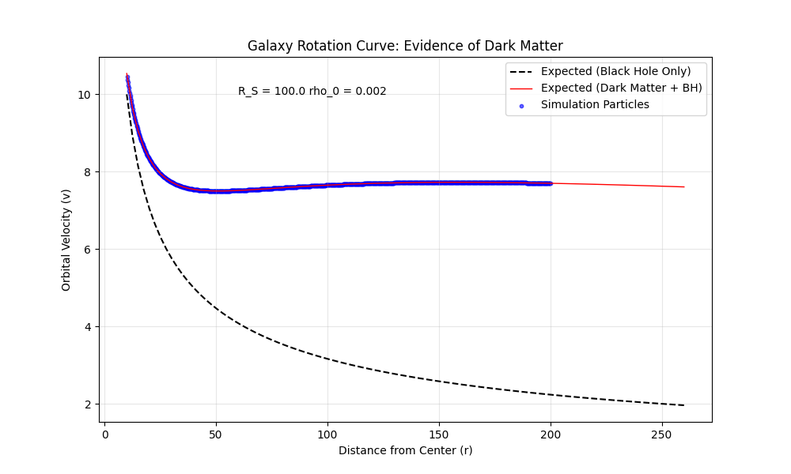

# GravityCore: High-Performance N-Body Physics Engine


**GravityCore** is a hybrid physics simulation engine capable of calculating gravitational interactions for thousands of bodies in real-time. It leverages **Modern C++ (C++17)** for high-performance computing and **Python** for high-level orchestration and visualization.


---

## Key Features

### 1. High-Performance Architecture
* **Hybrid C++/Python:** Computationally expensive $O(N^2)$ force calculations are offloaded to a compiled C++ backend, while simulation setup and analysis remain in Python.
* **Parallel Computing:** Utilizes **OpenMP** to parallelize force loops across all available CPU cores.
* **Data-Oriented Design (SoA):** Implements a **Structure of Arrays** memory layout (instead of Array of Structures) to maximize CPU cache locality and vectorization potential.

### 2. Scientific Accuracy
* **Symplectic Integration:** Uses the **Velocity Verlet** integrator to ensure energy conservation over long simulation times (unlike standard Euler integration).
* **Robust Physics:** Includes gravitational softening parameters ($\epsilon$) to prevent numerical singularities during close-range stellar collisions.
* **N-Body Interaction:** Simulates full all-to-all gravitational forces, allowing for complex phenomena like star clustering, tidal stripping, and galaxy formation.

##  Galactic Dynamics & Dark Matter

The engine goes beyond simple Keplerian orbits by implementing a **Navarro-Frenk-White (NFW) Dark Matter Halo**. This allows for the simulation of realistic galaxies where invisible mass dictates the motion of outer stars.

### The "Missing Mass" Problem
In a standard Newtonian system (Black Hole only), orbital velocity drops rapidly with distance ($v \propto 1/\sqrt{r}$). Real galaxies, however, exhibit "Flat Rotation Curves," implying the existence of a massive, invisible halo.

To replicate this, I implemented the cumulative mass distribution of the NFW profile directly into the C++ physics kernel:

$$M(\lt r) = 4 \pi \rho_0 R_s^3 \left[ \ln\left(1 + \frac{r}{R_s}\right) - \frac{r/R_s}{1 + r/R_s} \right]$$

### Validation: Rotation Curve Analysis
I verified the C++ implementation by simulating 500 stars and comparing their velocities against the theoretical curves.


*Figure: The Simulation (Blue Dots) perfectly hugs the theoretical Dark Matter curve (Red Line), maintaining high velocities at the galactic edge. Without this feature, stars would follow the dashed Black Line and the galaxy would disintegrate.*
---

##  Installation & Build

### Prerequisites
* **C++ Compiler** (GCC, Clang, or MSVC) supporting C++17
* **CMake** (Version 3.14+)
* **Python 3.11**
* **Libraries:** `numpy`, `matplotlib` (for visualization)
* A `requirements.txt` file is provided for easy installation.
**Quick Install:**
Ensure you are in your virtual environment (Python 3.11 recommended), then run:

```bash
pip install -r requirements.txt

### Build Instructions
The project uses **CMake** to automatically fetch dependencies (like `pybind11`) and compile the Python module.

```bash
# 1. Clone the repository
git clone [https://github.com/YOUR_USERNAME/GravityCore.git](https://github.com/YOUR_USERNAME/GravityCore.git)
cd GravityCore

# 2. Create build directory
mkdir build && cd build

# 3. Configure and Compile
cmake ..
cmake --build .

## Dynamic Simulation Control

The engine supports run-time configuration of the **Dark Matter Halo** properties via a Bash controller script, allowing you to experiment with different galaxy structures without recompiling.

### Usage
```bash
./runSim.sh [N_STARS ][R_SCALE] [RHO_0]
### R_SCALE (Default: 100.0)
### RHO_0 (Default: 0.001)
